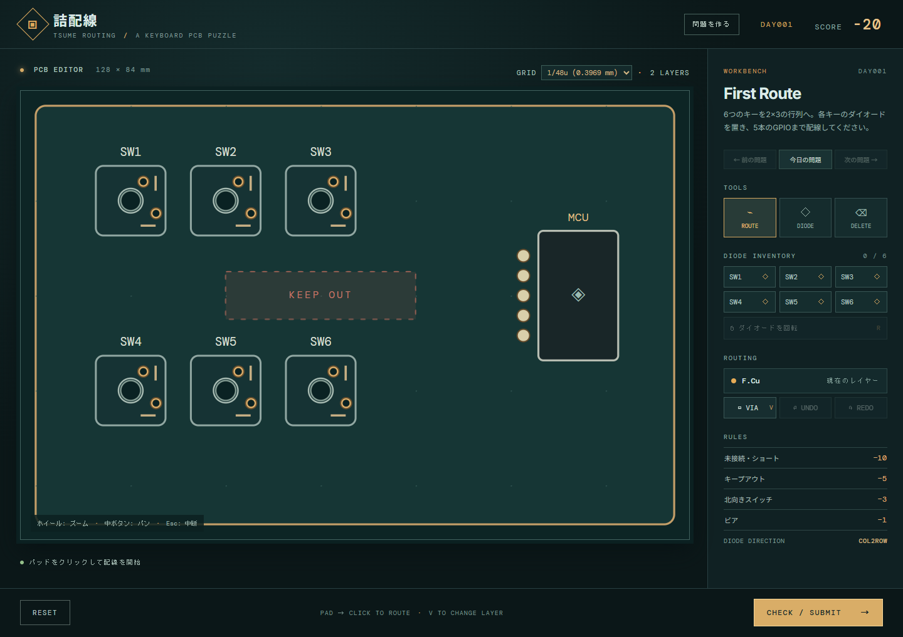

# 詰配線 / Tsume Routing

キーボードのキー行列を配線するブラウザパズルです。Day 001 は6キー、2行×3列、5本のMCUピンを使います。

**[ブラウザで遊ぶ](https://hringdrifi.github.io/tsume-routing/)**



## 起動

Node.js 20以降を用意し、次を実行します。

```bash
npm install
npm run dev
```

表示されたローカルURLをブラウザで開いてください。`npm test` で判定ロジックを、`npm run build` でビルドを確認できます。

## 遊び方

1. DIODEから各スイッチ専用のダイオードを選び、基板をクリックして配置します。配置済みのダイオードは盤面上でドラッグして移動できます。DIODE選択中は端子からもドラッグできます。Rキーか回転ボタンで90度回転します。SWITCHでスイッチを選び、Qキーか「スイッチを左に90°」で反時計回りに回転できます。回転した部品の端子は移動しますが、既存の配線は動きません。
2. ROUTEでF.Cu（表）かB.Cu（裏）を選び、パッドをクリックして配線を始めます。スイッチの電気ピンはスルーホールなので、B.Cuから直接始められます。ダイオードとMCUのパッドはF.Cuから始めます。マウス移動中は経路をプレビューし、クリックで折れ点を置き、別のパッドをクリックして確定します。同じ2つのパッド間を引き直すと、以前の配線は新しい経路に置き換わります。配線は1u＝19.05 mm基準の1/48uグリッドに固定され、水平・垂直・45度に曲がります。スイッチ端子の中心もこのグリッドに合わせています。
3. 配線中にVキーかVIAボタンでビアを置き、F.CuとB.Cuを切り替えます。スイッチ端子から開始した直後なら、レイヤーボタンかVキーでビアなしに開始面を切り替えられます。ダイオードとMCUのパッドへの接続はF.Cuで行います。Escは中断、Backspaceは直前の折れ点の削除です。
4. DELETEを選んで配線をクリックすると削除できます。Ctrl+Z / Ctrl+Shift+ZでUndo / Redoできます。ホイールでズーム、中ボタンドラッグでパンします。
5. CHECK / SUBMITで配線を検証します。未接続やショートは盤面にも表示されます。Resetで再挑戦できます。

進行状況はブラウザ内に自動保存され、同じ問題を再読込すると復元されます。

同じ層で配線が交差・接触すると導通します。異なる層はビアまたはスルーホールのMXピンを介して導通します。MCUの各ピンには番号とROW/COLの割り当てが表示されます。未接続のパッド間にはラッツネストの点線が表示され、接続すると消えます。各スイッチのCOLパッドを対応するCOLピンへ、反対側のパッドを専用ダイオードのスイッチ側へ、ダイオードの残りのパッドを対応するROWピンへつないでください。ダイオードのスイッチ側は`COL2ROW`ならアノード、`ROW2COL`ならカソードです。ダイオード内部とスイッチ内部は検証時に短絡として扱いません。

スイッチは[KiCadのCherry MX 3ピン（プレートマウント）フットプリント](https://github.com/KiCad/kicad-footprints/blob/master/Button_Switch_Keyboard.pretty/SW_Cherry_MX_1.00u_Plate.kicad_mod)を元にしています。2つの電気ピンは1/48uグリッドへ丸めているため、実物の穴位置とは最大約0.2 mm異なります。中心の直径4 mm穴は非メッキで配線できません。電気ピンはスルーホールなので、F.CuとB.Cuの両方へ接続できます。

基本点は100点です。未接続・ショートは各−10、キープアウト侵入は−5、北向きスイッチは各−3、ビアは各−1。キープアウト侵入はクリアを妨げません。

## 問題を作る・共有する

右上の「問題を作る」から問題エディタを開きます。スイッチとキープアウトを追加し、部品を選択して盤面クリックで配置します。ROW/COL数、各スイッチの割り当て、向き、MCUの位置、ダイオード方向を編集できます。MCUピン番号は位置順に割り当てます。JSONの読込・保存、共有リンクのコピーにも対応します。共有リンクは問題データをURLの`#p=`に含むため、サーバーは不要です。`?puzzle=day001`で同梱問題を直接開けます。

同梱問題JSONは`src/data/day001.json`にあります。トップページでは日本時間の日付からDaily番号を決め、`/day/001`または`?puzzle=day001`でも直接開けます。2日目以降はDay 001を元に向き、ダイオード方向、キープアウト、MCUピン配置を日ごとに変えます。判定、幾何計算、問題の読み込み、進行状況の保存は`src/lib`に分けています。
